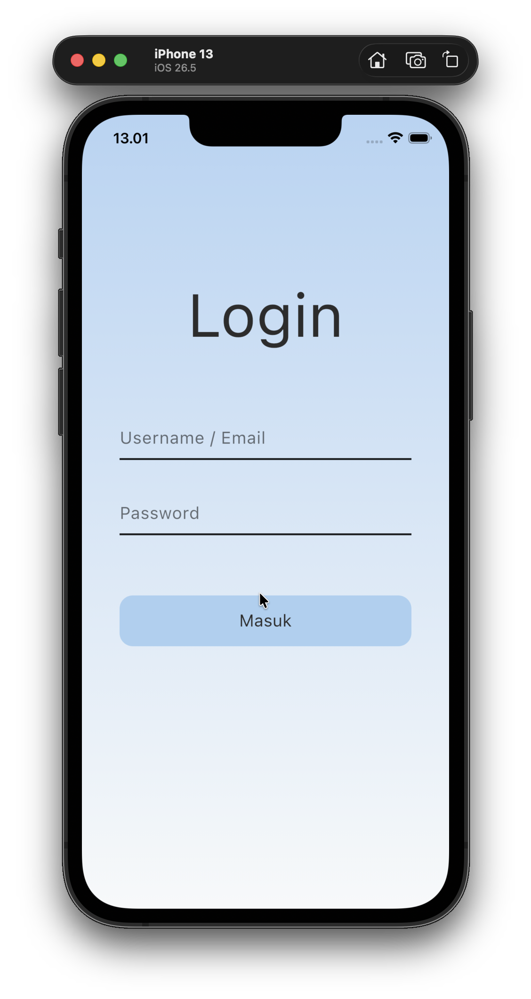
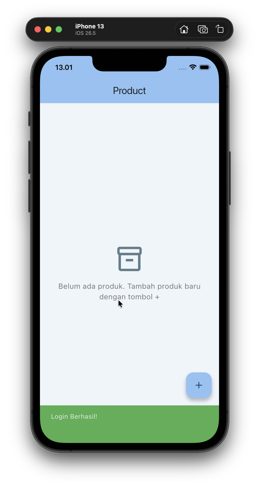
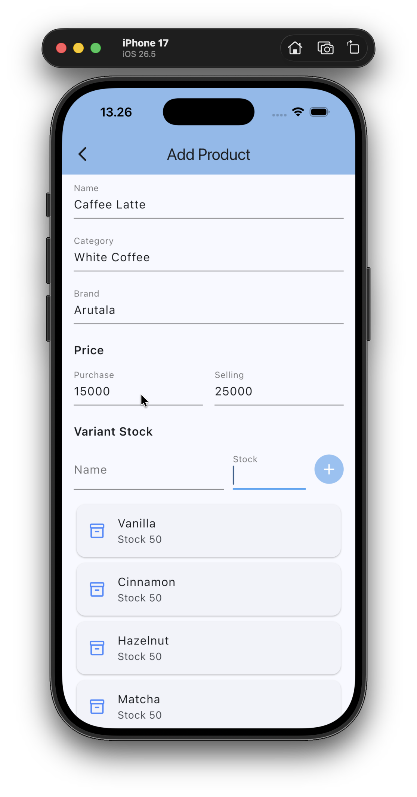
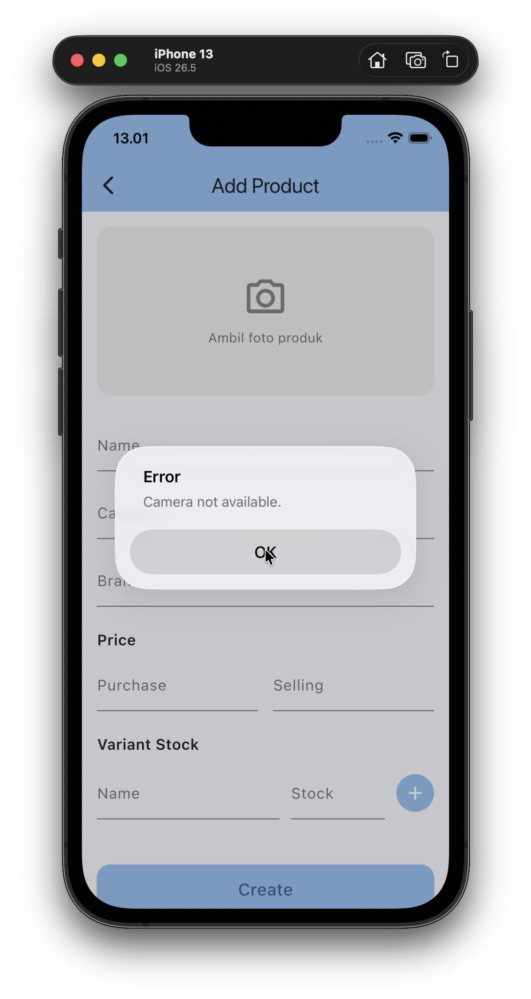
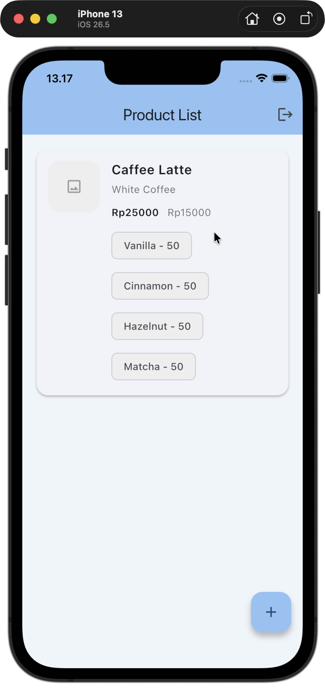
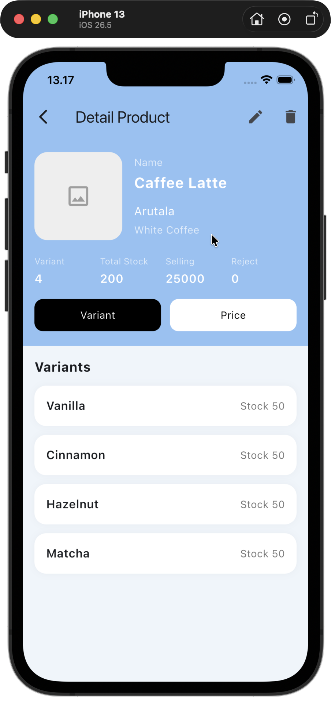
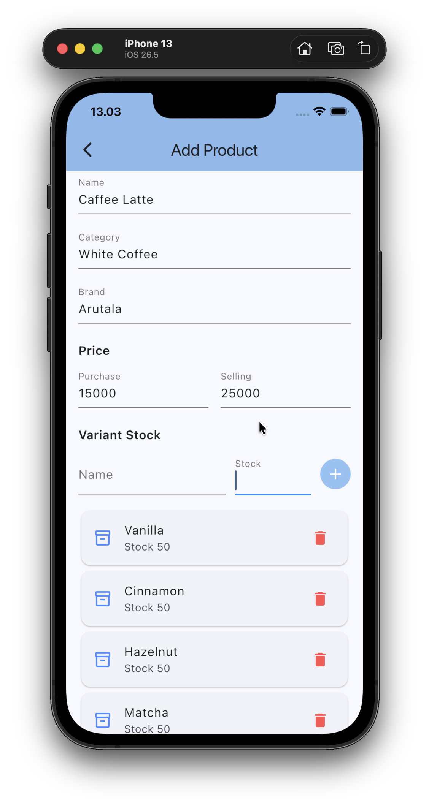
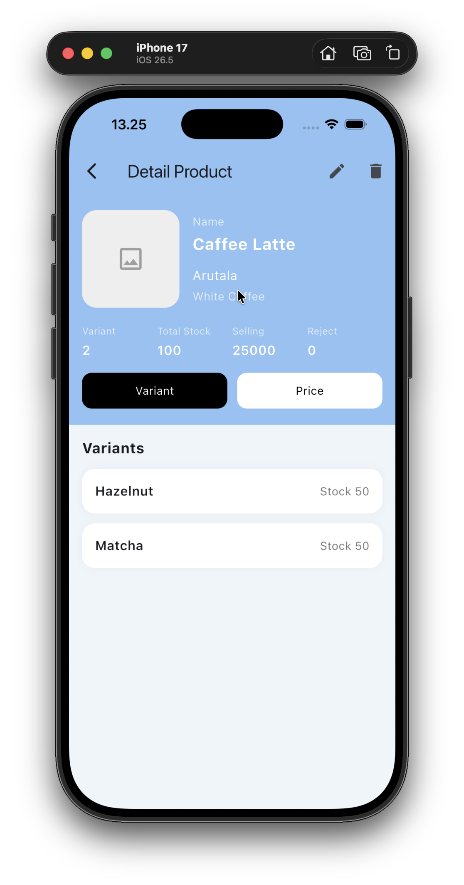
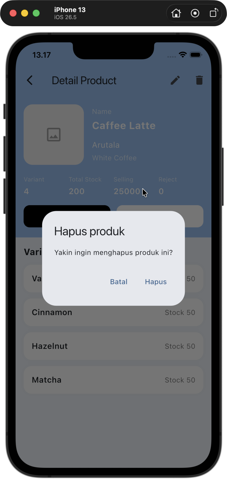
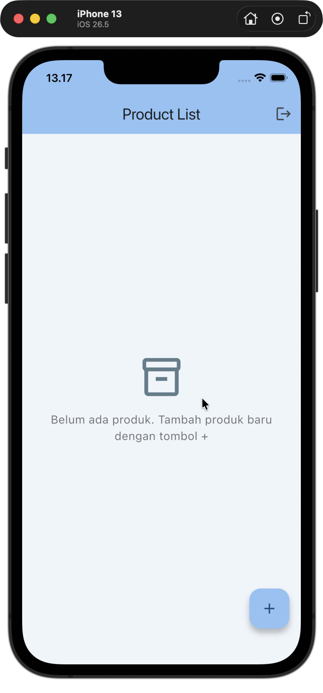

# Project Title

A brief description of what this project does and who it's for

# UTS-MobileComputing

A Flutter inventory app with login, product management, and local storage.

## Arsitektur dan Teknologi

- Menggunakan arsitektur MVC-like:
  - `lib/models/` untuk model data
  - `lib/controllers/` untuk logika bisnis / state management
  - `lib/pages/` untuk tampilan UI
- State management menggunakan `Provider`
- Local storage menggunakan `SharedPreferences`
  - Menyimpan status login
  - Menyimpan token autentikasi
- Image picker untuk foto produk

## Struktur Folder Penting

- `lib/main.dart` — entry point aplikasi dan setup provider
- `lib/models/product.dart` — model `Product` dan `ProductVariant`
- `lib/controllers/auth_controller.dart` — login/logout dan storage
- `lib/controllers/product_controller.dart` — CRUD produk
- `lib/services/auth_storage.dart` — SharedPreferences storage
- `lib/pages/` — semua halaman UI

## Alur Aplikasi dan Screenshot

Berikut adalah alur penggunaan aplikasi beserta tampilan _user interface_ (UI) untuk setiap tahapannya:

### 1. Halaman Login

Pengguna masuk ke aplikasi menggunakan kredensial default (`admin` / `123qweasd`). Status login dan token akan otomatis tersimpan di SharedPreferences.


### 2. Halaman Utama / Daftar Produk Awal

Setelah berhasil login, pengguna diarahkan ke halaman utama yang menampilkan daftar produk bawaan (_default_).


### 3. Halaman Tambah Produk

Ketika menekan tombol tambah (+), pengguna akan diarahkan ke form pembuatan produk baru untuk mengisi nama, kategori, harga, dan varian stock.


### 4. Penggunaan Kamera untuk Foto Produk

Di dalam halaman tambah produk, pengguna dapat menekan kotak gambar untuk membuka kamera bawaan perangkat dan mengambil foto produk secara langsung.


### 5. Daftar Produk (Setelah Ditambahkan)

Produk yang baru saja dibuat akan disimpan ke dalam State Management (`Provider`) dan langsung muncul di bagian bawah daftar produk pada halaman utama.


### 6. Halaman Detail Produk

Mengetuk salah satu kartu produk pada daftar akan membuka halaman detail yang menampilkan informasi lengkap, status stok, varian, serta harganya.


### 7. Halaman Edit Produk

Pengguna dapat mengubah informasi produk yang sudah ada (seperti nama, harga, atau stok) melalui halaman edit.


### 8. Detail Produk Setelah Diedit

Tampilan halaman detail produk akan langsung terbarui secara _real-time_ merefleksikan data baru yang baru saja diubah.


### 9. Konfirmasi Hapus Produk

Aplikasi menyediakan fitur untuk menghapus produk dari daftar dengan memunculkan dialog atau aksi konfirmasi hapus.


### 10. Daftar Produk Setelah Dihapus

Setelah produk dikonfirmasi hapus, State Management akan memperbarui data dan produk tersebut hilang dari daftar halaman utama.


## Menjalankan Aplikasi

1. Pastikan Flutter sudah terinstall.
2. Jalankan:
   ```bash
   flutter pub get
   flutter run
   ```

## Catatan

- Login default: `admin` / `123qweasd`
- Produk disimpan di memori aplikasi saat runtime
- Login state dan token disimpan di SharedPreferences
